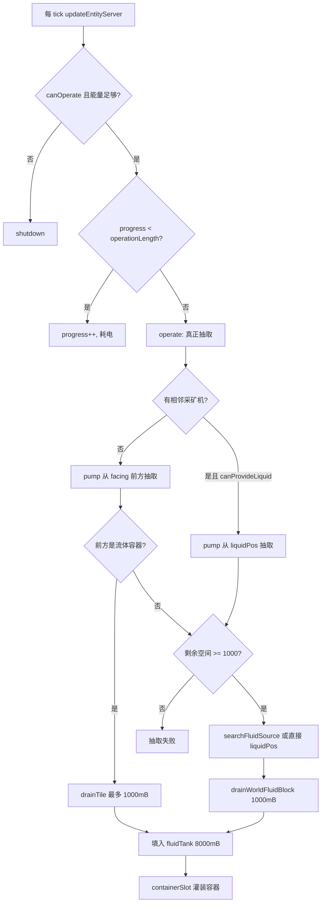

## User

检查pump 泵的流体抽取逻辑并报告。

## Assistant

正在搜索项目中与泵（pump）流体抽取相关的代码。


## Tools

- Search: pump|Pump
- Search: fluid.*extract|extract.*fluid|FluidExtract
- Search: **/*Pump*
- Read: D:\Files\Codes\JavaSources\IC2R\src\main\java\ic2\core\block\machine\tileentity\TileEntityPump.java
- Read: D:\Files\Codes\JavaSources\IC2R\src\main\java\ic2\core\util\PumpUtil.java
- Search: Pump|pump
- Search: drainWorldFluidBlock|drainTile|isFluidTile
- Read: D:\Files\Codes\JavaSources\IC2R\src\main\java\ic2\core\block\machine\tileentity\TileEntityMiner.java (331-450)
- Read: D:\Files\Codes\JavaSources\IC2R\src\main\java\ic2\core\block\machine\tileentity\TileEntityMiner.java (561-650)
- Read: D:\Files\Codes\JavaSources\IC2R\src\main\java\ic2\core\util\LiquidUtil.java (471-700)
- Search: canProvideLiquid|liquidPos
- Search: getWorldFluidLevel|getWorldFluid
- Read: D:\Files\Codes\JavaSources\IC2R\src\main\java\ic2\core\util\LiquidUtil.java (2-81)
- Search: drainWorldFluid|drainMb
- Read: D:\Files\Codes\JavaSources\IC2R\src\main\java\ic2\core\block\machine\tileentity\TileEntityMiner.java (51-120)
- Read: D:\Files\Codes\JavaSources\IC2R\src\main\java\ic2\core\block\machine\tileentity\TileEntityMiner.java (431-470)
- Read: D:\Files\Codes\JavaSources\IC2R\src\main\java\ic2\forge\EnvFluidHandlerForge.java (486-635)
- Search: addTankExtract
- Search: downSideFacings
- Read: D:\Files\Codes\JavaSources\IC2R\src\main\java\ic2\forge\EnvFluidHandlerForge.java (609-640)
- Search: canPump
- Read: D:\Files\Codes\JavaSources\IC2R\src\main\java\ic2\core\block\machine\tileentity\TileEntityElectricMachine.java (2-34)
- Search: operationsPerTick
- Read: D:\Files\Codes\JavaSources\IC2R\src\main\java\ic2\core\block\machine\tileentity\TileEntityMiner.java (201-330)
- Search: scripts/**/*
- Search: pump|Pump
- Read: D:\Files\Codes\JavaSources\IC2R\src\main\java\ic2\core\block\machine\tileentity\TileEntityStandardMachine.java (196-240)

## Assistant

# 泵（Pump）流体抽取逻辑报告

基于 `TileEntityPump`、`PumpUtil`、`LiquidUtil` 及采矿机联动代码的审查结果如下。

---

## 1. 总体架构

泵是耗电方块实体，核心职责：

1. 从世界或相邻流体容器抽取流体
2. 存入内部储罐（8000 mB，仅输出）
3. 通过槽位将流体灌入桶/罐，或经管道输出

涉及的主要文件：

| 文件 | 职责 |
|------|------|
| `TileEntityPump.java` | 主循环、抽取调度、采矿机联动 |
| `PumpUtil.java` | 沿流体流动方向回溯查找源方块 |
| `LiquidUtil.java` | 世界流体 / 方块实体流体的抽取封装 |
| `TileEntityMiner.java` | 采矿机发现液体后向泵提供坐标 |

---

## 2. 运行周期（每 tick）

```105:134:src/main/java/ic2/core/block/machine/tileentity/TileEntityPump.java
    protected void updateEntityServer()
    {
        super.updateEntityServer();
        boolean needsInvUpdate = false;
        if (this.canOperate() && this.energy.getEnergy() >= this.energyConsume * this.operationLength)
        {
            if (this.progress < this.operationLength)
            {
                this.progress++;
                this.energy.useEnergy(this.energyConsume);
            } else
            {
                this.progress = 0;
                this.operate(false);
            }

            this.activate(false);
        } else
        {
            this.shutdown(false);
        }

        needsInvUpdate |= this.containerSlot.processFromTank(this.fluidTank, this.outputSlot);
        // ...
    }
```

**默认参数：**

- `operationLength = 20` tick（一次完整抽取）
- `energyConsume = 1` EU/tick（单次约 20 EU）
- 储罐容量 8000 mB
- 支持升级：处理速度、变压器、储能、物品/流体产出

**流程：**

1. `canOperate()` 以 `sim=true` 预演能否抽到流体
2. 能量足够时，`progress` 从 0 累加到 `operationLength`
3. 进度满后调用 `operate(false)` 真正抽取并写入储罐
4. `containerSlot` 从储罐向输出槽灌装容器

---

## 3. 抽取入口：`operate()` / `pump()`

### 3.1 工作模式选择

```141:187:src/main/java/ic2/core/block/machine/tileentity/TileEntityPump.java
    public boolean operate(boolean sim)
    {
        // 在除 UP 外的各方向寻找 TileEntityMiner
        if (this.miner != null)
        {
            if (this.miner.canProvideLiquid)
            {
                liquid = this.pump(this.miner.liquidPos, sim, this.miner);
            }
        } else
        {
            Direction dir = this.getFacing();
            liquid = this.pump(this.worldPosition.relative(dir), sim, this.miner);
        }
        // 模拟/实际填充储罐
    }
```

| 模式 | 起始位置 | 触发条件 |
|------|----------|----------|
| **独立模式** | 泵朝向（facing）前方一格 | 未检测到采矿机 |
| **采矿机联动** | `miner.liquidPos` | 相邻（非 UP 方向）有采矿机且 `canProvideLiquid == true` |

采矿机检测范围：`Util.downSideFacings`（DOWN + 四个水平方向），不含上方。

### 3.2 核心抽取：`pump(startPos, sim, miner)`

分两阶段，**有优先级**：

#### 阶段 A：方块实体流体容器（仅独立模式）

```199:213:src/main/java/ic2/core/block/machine/tileentity/TileEntityPump.java
        if (miner == null && freeSpace > 0)
        {
            BlockEntity te = world.getBlockEntity(startPos);
            BlockState state = world.getBlockState(startPos);
            Direction side = this.getFacing().getOpposite();
            if (LiquidUtil.isFluidTile(state, te, side))
            {
                if (freeSpace > 1000)
                {
                    freeSpace = 1000;
                }

                return LiquidUtil.drainTile(state, world, startPos, side, freeSpace, sim);
            }
        }
```

- 仅 `miner == null` 时生效
- 检查泵**朝向反方向**一侧的 Forge `IFluidHandler`
- 单次最多抽 `min(剩余空间, 1000)` mB
- 储罐有任意空余即可（不要求 ≥ 1000）

#### 阶段 B：世界流体方块

```215:231:src/main/java/ic2/core/block/machine/tileentity/TileEntityPump.java
        if (freeSpace >= 1000)
        {
            BlockPos cPos;
            if (miner != null && miner.canProvideLiquid)
            {
                cPos = miner.liquidPos;
            } else
            {
                cPos = PumpUtil.searchFluidSource(world, startPos);
            }

            if (cPos != null)
            {
                return LiquidUtil.drainWorldFluidBlock(world, cPos, sim);
            }
        }
```

- **前提**：储罐剩余空间 ≥ 1000 mB
- 采矿机模式：直接用 `liquidPos`，不做源搜索
- 独立模式：用 `PumpUtil.searchFluidSource()` 从起始格向上游找源
- 每次成功抽取固定 **1000 mB**（一个源方块）

---

## 4. 源方块搜索：`PumpUtil.searchFluidSource()`

经典 IC2 流体回溯算法：

### 4.1 衰减值（decay）

```224:235:src/main/java/ic2/core/util/PumpUtil.java
    protected static int getFlowDecay(BlockState state, Level world, BlockPos pos)
    {
        Block block = state.getBlock();
        int level = FluidHandler.getWorldFluidLevel(state, world, pos);
        if (level >= 0)
        {
            return level;
        } else
        {
            return block instanceof LiquidBlock ? state.getValue(LiquidBlock.LEVEL) : -1;
        }
    }
```

- `decay = 0` → 源方块
- `decay = 1~7` → 流动流体，数值越大离源越远
- `decay = -1` → 非流体

### 4.2 搜索步骤

1. **向上游追踪**（最多 64 步）：`moveUp()` → `moveSideways()`，沿 decay 递减方向移动
2. **横向扫描源**：在四邻域找 `decay == 0`
3. **兜底 5×5 扫描**（±2 格）：
    - 找到 `decay == 0` → 返回
    - `decay >= 7` 或非 `LiquidBlock` → **`world.removeBlock(cPos, false)` 直接清除**

### 4.3 世界流体抽取：`LiquidUtil.drainWorldFluidBlock()`

```646:677:src/main/java/ic2/core/util/LiquidUtil.java
    public static Ic2FluidStack drainWorldFluidBlock(Level world, BlockPos pos, boolean simulate)
    {
        Ic2FluidStack drained = FluidHandler.drainWorldFluid(state, world, pos, simulate);
        // ...
        if (block instanceof LiquidBlock && state.getValue(LiquidBlock.LEVEL) == 0)
        {
            // 水/岩浆源方块 → 1000 mB，非模拟时 removeBlock
        }
    }
```

底层 `EnvFluidHandlerForge.drainWorldFluid()`：

- `IFluidBlock`：走 `canDrain()` + `drain()`
- 原版 `LiquidBlock`：**仅 `fluidState.isSource()`** 可抽，否则返回 `null`
- 非模拟时：源方块设为空气

**结论**：泵不会直接抽流动格（LEVEL > 0），而是先回溯到源再一次性抽 1000 mB。

---

## 5. 采矿机联动

### 5.1 采矿机发现液体

```438:445:src/main/java/ic2/core/block/machine/tileentity/TileEntityMiner.java
            LiquidUtil.LiquidData liquidData = LiquidUtil.getLiquid(world, target);
            if (liquidData != null)
            {
                if (liquidData.isSource || this.pumpMode && this.canPump())
                {
                    this.liquidPos = new BlockPos(target);
                    this.canProvideLiquid = true;
                    return ... Failed_Temp;  // 暂停采矿，等待泵抽走
                }
            }
```

- 遇到**源方块**时设置 `liquidPos`，返回 `Failed_Temp` 暂停
- 相邻泵通过 `isPumpConnected()` 用 `pump(target, true, miner)` 验证能否抽取

### 5.2 连接检测

```615:628:src/main/java/ic2/core/block/machine/tileentity/TileEntityMiner.java
    public boolean isPumpConnected(BlockPos target)
    {
        for (Direction dir : Util.ALL_DIRS)
        {
            BlockEntity te = world.getBlockEntity(this.worldPosition.relative(dir));
            if (te instanceof TileEntityPump && ((TileEntityPump) te).pump(target, true, this) != null)
            {
                return true;
            }
        }
        return false;
    }
```

采矿机六面邻接泵均可；液体方块在泵可抽范围内时，采矿机才会将其视为可处理目标。

---

## 6. 流体输出

| 出口 | 机制 |
|------|------|
| 容器槽 | `InvSlotConsumableLiquid`（Fill），从储罐灌桶到 `outputSlot` |
| 管道 | `addTankExtract("fluid", 8000)`，储罐为 O（输出）侧 |
| 压缩机 | 相邻泵可被 `TileEntityCompressor` 从 UP 方向抽水为雪球配方 |

---

## 7. 逻辑流程图



---

## 8. 发现的问题与注意点

### 8.1 `canPump()` 恒为 `false`（疑似未完成）

```574:577:src/main/java/ic2/core/block/machine/tileentity/TileEntityMiner.java
    public boolean canPump()
    {
        return false;
    }
```

`pumpMode` 相关分支（扫描液体、穿透非源流体等）**实际不会生效**。当前采矿机联动**仅支持源方块**，不支持抽流动格。

### 8.2 `operationsPerTick` 未使用

`setUpgradestat()` 会计算 `operationsPerTick`，但 `updateEntityServer()` 没有像 `TileEntityStandardMachine` 那样循环多次操作。升级模块的「每 tick 多次操作」对泵**可能无效**，只有 `operationLength` 缩短带来的加速会生效。

### 8.3 储罐空间门槛不对称

| 来源 | 最低剩余空间 |
|------|-------------|
| 流体容器（独立模式） | > 0（最多 1000） |
| 世界流体 | ≥ 1000 |

储罐剩 500 mB 时，无法抽世界流体，但仍可能从容器抽 500 mB。

### 8.4 采矿机模式下跳过容器抽取

`miner != null` 时，阶段 A（前方流体容器）被跳过；联动时**只抽采矿机报告的 `liquidPos`**。

### 8.5 `PumpUtil` 兜底会清除方块

5×5 兜底扫描中，`decay >= 7` 或非 `LiquidBlock` 的流体会被 `removeBlock`，可能影响部分 mod 流体方块，属于较激进的行为。

### 8.6 能量门槛检查

启动一轮需 `energy >= energyConsume * operationLength`（默认 20 EU），过程中每 tick 再扣 `energyConsume`。储能与升级会改变这些数值。

---

## 9. 总结

泵的抽取策略可以概括为：

1. **独立放置**：优先抽朝向前的流体容器；否则沿流动方向找源，每次 1000 mB
2. **配合采矿机**：采矿机遇源方块暂停并上报坐标，相邻泵直接抽该格
3. **不抽流动格**：只抽源方块（LEVEL=0 / `isSource()`）
4. **每 20 tick 一次**完整抽取（默认），结果进 8000 mB 储罐再输出

整体设计延续经典 IC2 泵行为；需关注 `canPump()` 未实现、`operationsPerTick` 未接入 tick 循环，以及 `PumpUtil` 兜底清除方块的风险。